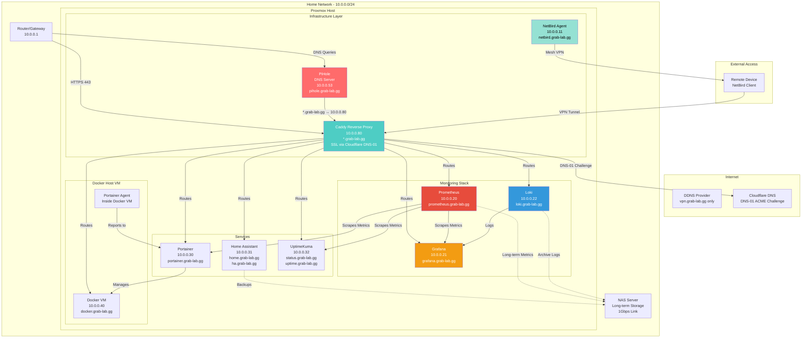
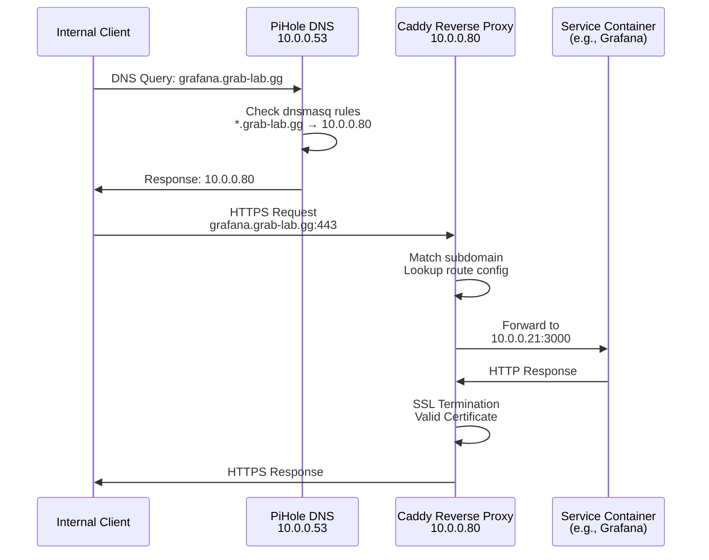
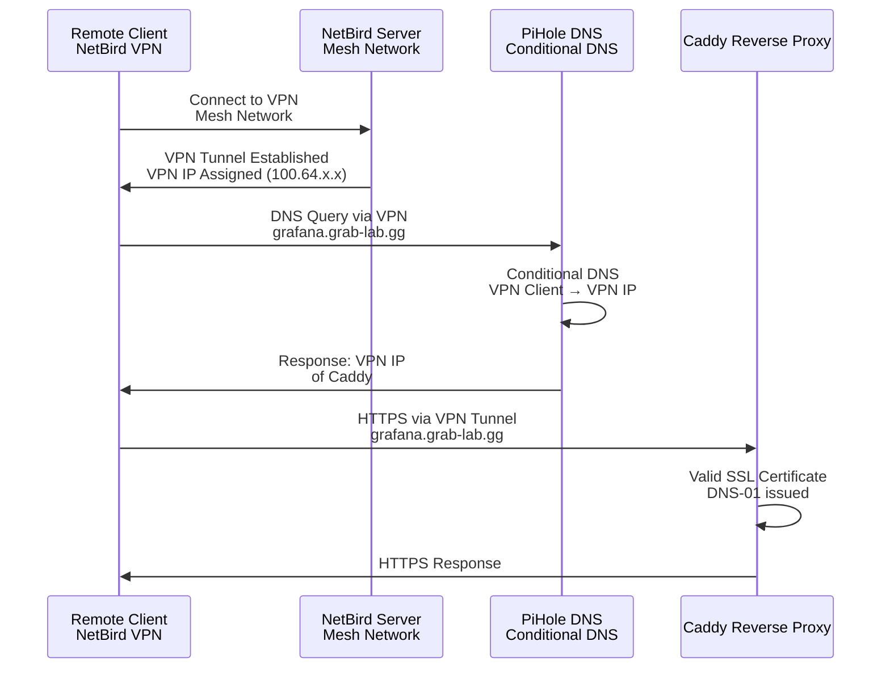
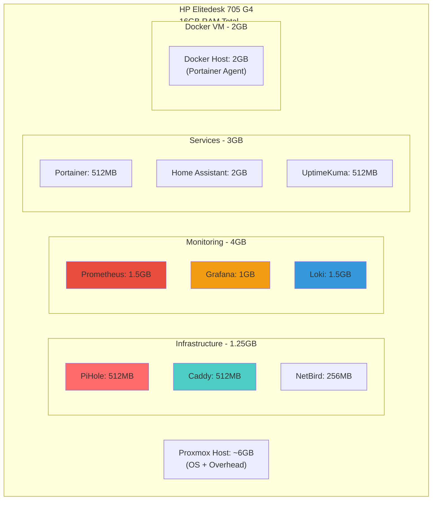
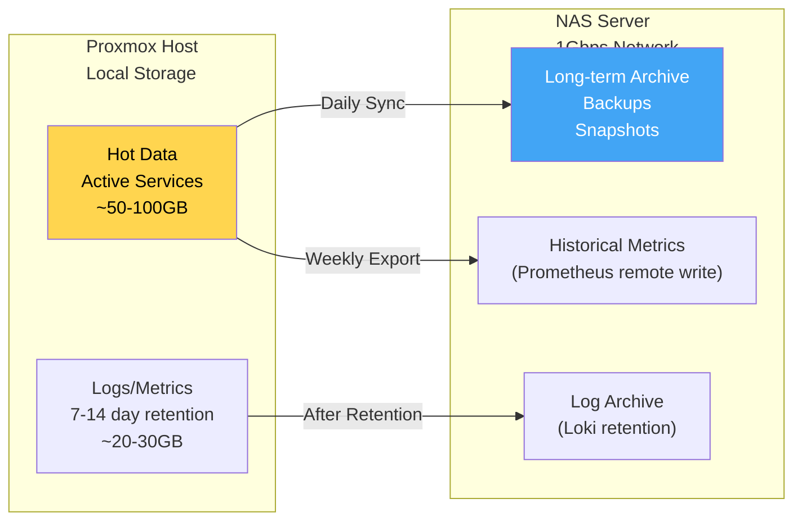
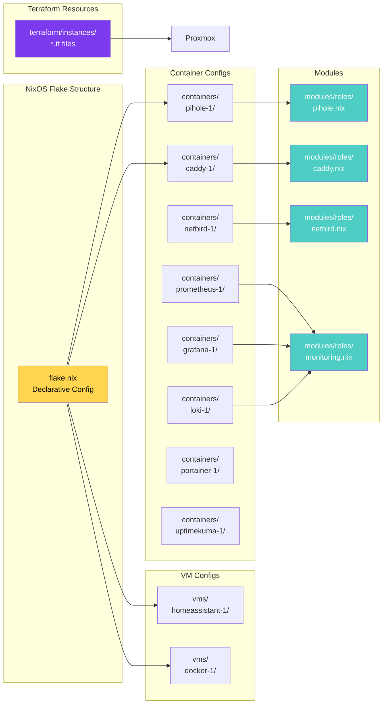

# Homelab Architecture Design Document

**Last Updated:** 2026-01-25  
**Hardware:** HP Elitedesk 705 G4 (Ryzen, 16GB RAM)  
**Platform:** Proxmox VE with NixOS containers/VMs  
**Network:** 10.0.0.0/24 (1Gbps LAN)

## Overview

This document describes the architecture for a homelab setup managing multiple services through a reverse proxy with SSL certificates, accessible via subdomains under `*.grab-lab.gg` (and `*.grab-lab.dev`). External access is provided via NetBird mesh VPN.

## Core Principles

1. **No port-based access**: All services accessible via clean subdomains (e.g., `grafana.grab-lab.gg`)
2. **Real SSL certificates**: DNS-01 ACME challenges via Cloudflare DNS API (no self-signed certs)
3. **Secure external access**: NetBird mesh VPN (no public exposure of services)
4. **Split DNS**: Internal services resolve only via Pi-hole; public DNS returns NXDOMAIN
4. **Infrastructure as Code**: All configurations managed via NixOS flake + Terraform
5. **Secrets management**: SOPS + age for encrypted secrets
6. **Declarative infrastructure**: Terraform manages Proxmox resources, NixOS manages OS configuration

## Network Architecture



## DNS Resolution Flow



## External Access Flow (NetBird VPN)



## SSL Certificate Creation (DNS-01 ACME Challenge)

### How It Works

1. **Caddy requests certificate** from Let's Encrypt for `*.grab-lab.gg`
2. **Let's Encrypt sends DNS challenge token**
3. **Caddy uses Cloudflare API** to create TXT record: `_acme-challenge.grab-lab.gg` with token
4. **Let's Encrypt queries DNS** to verify domain ownership
5. **Certificate issued automatically**
6. **Caddy auto-renews** before expiration (~60 days)

### Key Points

- ✅ **No port forwarding needed** - validation happens via DNS
- ✅ **Real certificates** - trusted by all browsers (not self-signed)
- ✅ **Wildcard support** - `*.grab-lab.gg` covers all subdomains
- ✅ **Automatic renewal** - no manual intervention
- ✅ **No public service exposure** - only ACME challenge records are public

### Configuration

- **DNS Provider**: Cloudflare (nameservers pointed to Cloudflare)
- **Caddy Plugin**: `github.com/caddy-dns/cloudflare`
- **Credentials**: Stored in SOPS secrets (`secrets/vms/caddy-1.yaml`)
- **API Token**: Cloudflare API token with DNS edit permissions only

## Split DNS Architecture

This infrastructure uses a **split-DNS model** to ensure services are only reachable when connected to the home network or VPN.

### Public DNS (Cloudflare)

Only the following records exist in public DNS:

| Record | Type | Value | Purpose |
|--------|------|-------|---------|
| `vpn.grab-lab.gg` | A | `<home public IP>` | DDNS for NetBird VPN anchor |
| `_acme-challenge.*` | TXT | `<managed by ACME>` | Automated certificate validation |

**Important**: No wildcard A records (`*.grab-lab.gg`) exist in public DNS. Public resolvers return **NXDOMAIN** for service subdomains.

### Private DNS (Pi-hole @ 10.0.0.53)

Pi-hole is authoritative for internal service resolution:

| Record | Value | Purpose |
|--------|-------|---------|
| `*.grab-lab.gg` | `10.0.0.80` | All services route to Caddy |

### Security Benefits

1. **Services are invisible** to the public internet
2. **VPN required** - cannot access services without Pi-hole DNS
3. **No DNS leakage** - public resolvers cannot reveal internal IPs
4. **Same URLs everywhere** - identical experience locally and via VPN
5. **Defense in depth** - VPN controls reachability, DNS controls visibility

### Verification

```bash
# Internal (via Pi-hole) - should return 10.0.0.80
dig ha.grab-lab.gg @10.0.0.53

# Public (via Google DNS) - should return NXDOMAIN
dig ha.grab-lab.gg @8.8.8.8
```

## IP Address Allocation

| Service | IP Address | Subdomain(s) | Type | RAM | Notes |
|---------|-----------|--------------|------|-----|-------|
| **Infrastructure** |
| PiHole | 10.0.0.53 | pihole.grab-lab.gg | Container | 512MB | DNS + Adblock |
| Caddy | 10.0.0.80 | caddy.grab-lab.gg<br/>*.grab-lab.gg | Container | 512MB | Reverse Proxy + SSL |
| NetBird | 10.0.0.11 | netbird.grab-lab.gg | Container | 256MB | Mesh VPN |
| **Monitoring** |
| Prometheus | 10.0.0.20 | prometheus.grab-lab.gg | Container | 1.5GB | Metrics collection |
| Grafana | 10.0.0.21 | grafana.grab-lab.gg | Container | 1GB | Dashboards |
| Loki | 10.0.0.22 | loki.grab-lab.gg | Container | 1.5GB | Log aggregation |
| **Services** |
| Portainer | 10.0.0.30 | portainer.grab-lab.gg | Container | 512MB | Container management |
| Home Assistant | 10.0.0.31 | home.grab-lab.gg<br/>ha.grab-lab.gg | VM | 2GB | Home automation |
| UptimeKuma | 10.0.0.32 | status.grab-lab.gg<br/>uptime.grab-lab.gg | Container | 512MB | Uptime monitoring |
| Docker Host | 10.0.0.40 | docker.grab-lab.gg | VM | 2GB | Docker + Portainer Agent |

**Total RAM Allocation:** ~10GB (leaving ~6GB for Proxmox host and overhead)

## Resource Allocation



## Storage Strategy



### Storage Guidelines

- **Loki**: Retain 7-14 days locally, archive older logs to NAS
- **Prometheus**: Keep 30 days locally, remote write to NAS for long-term
- **Home Assistant**: Use built-in snapshot functionality to NAS
- **Backups**: Daily snapshots of critical VMs/containers to NAS

## Infrastructure Management Architecture

```mermaid
graph TB
    subgraph "NixOS Flake"
        Flake["flake.nix<br/>OS Configuration"]
        Build["nix build<br/>Generate Images"]
    end
    
    subgraph "Terraform"
        TFConfig["terraform/<br/>Resource Definitions"]
        TFApply["terraform apply<br/>Create/Update Resources"]
    end
    
    subgraph "Proxmox"
        Proxmox["Proxmox Host<br/>VMs & Containers"]
    end
    
    subgraph "Deployment"
        DeployRS["deploy-rs<br/>Deploy NixOS Config"]
    end
    
    Flake --> Build
    Build -->|Images| TFConfig
    TFConfig --> TFApply
    TFApply --> Proxmox
    Proxmox --> DeployRS
    DeployRS -->|Config Updates| Proxmox
    
    style Flake fill:#ffd54f,color:#000
    style TFConfig fill:#7c3aed,color:#fff
    style Proxmox fill:#e74c3c,color:#fff
    style DeployRS fill:#4ecdc4,color:#fff
```

### Infrastructure Management Stack

**Three-Layer Declarative Approach:**

1. **NixOS Flake** (`flake.nix`)
   - Declares OS configurations
   - Builds Proxmox-compatible images
   - Manages service configurations

2. **Terraform** (`terraform/`)
   - Declares Proxmox infrastructure resources
   - Manages VM/container lifecycle
   - Tracks infrastructure state

3. **deploy-rs** (`just deploy`)
   - Deploys NixOS configurations to running systems
   - Handles remote updates

**Workflow:**
```
NixOS Build → Terraform Apply → deploy-rs Deploy
```

## Service Deployment Architecture



## Infrastructure Management

### Terraform Integration

Terraform manages Proxmox infrastructure resources declaratively:

**Structure:**
- `terraform/modules/` - Reusable modules (VM, LXC, image-upload)
- `terraform/instances/` - Resource definitions per service
- `terraform/provider.tf` - Proxmox provider configuration
- `terraform/variables.tf` - Common variables

**Workflow:**
1. **Build NixOS image:** `nix build .#caddy-1`
2. **Plan Terraform:** `just tf-plan` or `cd terraform && terraform plan`
3. **Apply Terraform:** `just tf-apply` or `cd terraform && terraform apply`
4. **Bootstrap secrets:** `just bootstrap-container caddy-1 10.0.0.10`
5. **Deploy config:** `just deploy-container caddy-1`

**Benefits:**
- ✅ Declarative infrastructure management
- ✅ State tracking (knows what exists)
- ✅ Update resources by changing `.tf` files
- ✅ Prevents accidental destruction
- ✅ Integrates with existing NixOS workflow

**See:** [terraform/README.md](../terraform/README.md) for detailed documentation

## Implementation Phases

### Phase 1: Infrastructure Foundation ✅ (Partially Complete)

**Status:** PiHole already deployed

**Tasks:**
1. ✅ Deploy PiHole (already done)
2. ✅ Configure PiHole wildcard DNS (`*.grab-lab.gg → 10.0.0.80`)
3. ⏳ Test local DNS resolution
4. ⏳ Deploy Caddy reverse proxy container

**Commands (Terraform approach):**
```bash
# 1. Create NixOS config
just new-container caddy-1
# Edit containers/caddy-1/configuration.nix
# Edit containers/caddy-1/proxmox.nix

# 2. Build image
nix build .#caddy-1

# 3. Create Terraform resource (terraform/instances/caddy-1.tf)
# See terraform/instances/example-lxc.tf

# 4. Apply Terraform
just tf-init
just tf-plan
just tf-apply

# 5. Bootstrap secrets
just bootstrap-container caddy-1 10.0.0.80

# 6. Deploy NixOS config
just deploy-container caddy-1
```

**Commands (Script approach - legacy):**
```bash
just new-container caddy-1
# Edit containers/caddy-1/configuration.nix
# Edit containers/caddy-1/proxmox.nix
just proxmox-create-container caddy-1
just bootstrap-container caddy-1 10.0.0.80
just deploy-container caddy-1
```

### Phase 2: SSL Certificates

**Tasks:**
1. Point domain nameservers to Cloudflare
2. Create Cloudflare API token (DNS edit only, scoped to zone)
3. Add credentials to SOPS secrets (`secrets/vms/caddy-1.yaml`)
4. Configure Caddy with Cloudflare DNS plugin
5. Generate wildcard certificate for `*.grab-lab.gg`
6. Verify HTTPS access with valid certificates

**Cloudflare API Setup:**
- Login to Cloudflare dashboard
- Navigate to My Profile → API Tokens
- Create token with "Edit zone DNS" permission for `grab-lab.gg` zone only
- Store in SOPS: `sops secrets/vms/caddy-1.yaml`

**Caddy Configuration:**
- Build Caddy with Cloudflare plugin: `xcaddy build --with github.com/caddy-dns/cloudflare`
- Configure DNS-01 challenge in Caddyfile
- Certificates auto-renew every ~60 days

### Phase 3: Monitoring Stack

**Tasks:**
1. Deploy Prometheus container
2. Deploy Grafana container
3. Deploy Loki container
4. Configure Grafana data sources (Prometheus + Loki)
5. Set up basic dashboards
6. Configure Prometheus scraping targets

**Commands:**
```bash
just new-container prometheus-1
just new-container grafana-1
just new-container loki-1
# Configure each...
```

### Phase 4: External Access (NetBird)

**Tasks:**
1. Deploy NetBird agent container
2. Configure NetBird mesh VPN
3. Set up NetBird coordination server (or use managed service)
4. Configure conditional DNS in PiHole for VPN clients
5. Test VPN access from remote device

**Important Notes:**
- **No DDNS required** - NetBird handles IP assignment automatically
- NetBird assigns stable IPs in `100.64.0.0/10` range
- VPN clients get friendly domain names automatically

### Phase 5: Services Deployment

**Tasks:**
1. Deploy Portainer container
2. Deploy Docker VM with Portainer agent
3. Deploy Home Assistant VM
4. Deploy UptimeKuma container
5. Configure Caddy routes for all services

**Commands:**
```bash
just new-container portainer-1
just new-container uptimekuma-1
just new homeassistant-1
just new docker-1
# Configure each...
```

### Phase 6: Integration & Monitoring

**Tasks:**
1. Configure Prometheus to scrape all services
2. Set up Grafana dashboards for all services
3. Configure Loki log collection
4. Set up UptimeKuma monitoring endpoints
5. Configure backup jobs to NAS
6. Set up alerting (optional)

## DNS Configuration

### PiHole Wildcard DNS

Configured in `modules/roles/pihole.nix`:

```nix
services.pihole-ftl = {
  settings = {
    misc = {
      dnsmasq_lines = [
        # Upstream DNS servers
        "server=8.8.8.8"
        "server=8.8.4.4"
        # Wildcard DNS for grab-lab.gg → Caddy reverse proxy
        "address=/.grab-lab.gg/10.0.0.80"
      ];
    };
  };
};
```

### DNS Push via NetBird

When NetBird is deployed, it pushes Pi-hole (10.0.0.53) as the DNS server to all VPN clients. Combined with subnet routing for 10.0.0.0/24, this ensures:
- VPN clients use Pi-hole for DNS resolution
- All `*.grab-lab.gg` subdomains resolve to Caddy (10.0.0.80)
- Same URLs work identically from home and remotely

### ACL Enforcement (NetBird)

NetBird ACLs enforce least-privilege access:
- Clients → Pi-hole (TCP/UDP 53) ✅
- Clients → Caddy (TCP 443) ✅
- Everything else ❌

## Caddy Reverse Proxy Configuration

### Service Routes

All services accessible via subdomains:

| Service | Subdomain | Backend | Port |
|---------|-----------|---------|------|
| PiHole | pihole.grab-lab.gg | 10.0.0.53 | 80 |
| Grafana | grafana.grab-lab.gg | 10.0.0.21 | 3000 |
| Prometheus | prometheus.grab-lab.gg | 10.0.0.20 | 9090 |
| Loki | loki.grab-lab.gg | 10.0.0.22 | 3100 |
| Portainer | portainer.grab-lab.gg | 10.0.0.30 | 9000 |
| Home Assistant | home.grab-lab.gg<br/>ha.grab-lab.gg | 10.0.0.31 | 8123 |
| UptimeKuma | status.grab-lab.gg<br/>uptime.grab-lab.gg | 10.0.0.32 | 3001 |
| NetBird | netbird.grab-lab.gg | 10.0.0.11 | 8080 |

### Caddyfile Structure

```caddyfile
{
  # Global options - Cloudflare DNS-01 ACME
  acme_dns cloudflare {env.CLOUDFLARE_API_TOKEN}
}

# Wildcard certificate for all subdomains
*.grab-lab.gg {
  tls {
    dns cloudflare {env.CLOUDFLARE_API_TOKEN}
  }
  
  # PiHole admin
  @pihole host pihole.grab-lab.gg
  handle @pihole {
    reverse_proxy http://10.0.0.53:80 {
      header_up Host {host}
      header_up X-Real-IP {remote}
      header_up X-Forwarded-For {remote}
      header_up X-Forwarded-Proto {scheme}
    }
  }
  
  # Grafana
  @grafana host grafana.grab-lab.gg
  handle @grafana {
    reverse_proxy http://10.0.0.21:3000 {
      header_up Host {host}
      header_up X-Real-IP {remote}
    }
  }
  
  # Prometheus
  @prometheus host prometheus.grab-lab.gg
  handle @prometheus {
    reverse_proxy http://10.0.0.20:9090 {
      header_up Host {host}
    }
  }
  
  # Loki
  @loki host loki.grab-lab.gg
  handle @loki {
    reverse_proxy http://10.0.0.22:3100 {
      header_up Host {host}
    }
  }
  
  # Portainer
  @portainer host portainer.grab-lab.gg
  handle @portainer {
    reverse_proxy http://10.0.0.30:9000 {
      header_up Host {host}
    }
  }
  
  # Home Assistant
  @homeassistant host home.grab-lab.gg ha.grab-lab.gg
  handle @homeassistant {
    reverse_proxy http://10.0.0.31:8123 {
      header_up Host {host}
      header_up X-Forwarded-For {remote}
      header_up X-Forwarded-Proto {scheme}
    }
  }
  
  # UptimeKuma
  @uptimekuma host status.grab-lab.gg uptime.grab-lab.gg
  handle @uptimekuma {
    reverse_proxy http://10.0.0.32:3001 {
      header_up Host {host}
    }
  }
  
  # NetBird
  @netbird host netbird.grab-lab.gg
  handle @netbird {
    reverse_proxy http://10.0.0.11:8080 {
      header_up Host {host}
    }
  }
  
  # Default catch-all
  handle {
    respond "Service not found" 404
  }
}
```

## Security Considerations

### SSL/TLS
- ✅ **Real certificates**: DNS-01 ACME challenges via Cloudflare API
- ✅ **Automatic renewal**: Caddy handles renewal before expiration
- ✅ **Wildcard support**: Single certificate for all subdomains
- ✅ **No port forwarding**: DNS validation doesn't require open ports

### Network Security
- ✅ **No public exposure**: Services not accessible from internet
- ✅ **VPN required**: External access only via NetBird mesh VPN
- ✅ **Split DNS**: Public resolvers return NXDOMAIN for services
- ✅ **Internal DNS**: PiHole handles all internal resolution
- ✅ **ACL enforcement**: NetBird restricts access to DNS and Caddy only

### Secrets Management
- ✅ **SOPS + age**: All secrets encrypted in Git
- ✅ **Per-service secrets**: Each service has its own secret file
- ✅ **API credentials**: Cloudflare API token stored in SOPS
- ✅ **No hardcoded secrets**: All sensitive data in encrypted files
- ✅ **Terraform secrets separation**: Infrastructure secrets (`secrets/terraform.yaml`) kept separate from VM/container secrets (`secrets/common.yaml`, `secrets/vms/*.yaml`) to avoid exposing Proxmox credentials to VMs/containers

### Access Control
- ✅ **HTTPS everywhere**: All services behind SSL
- ✅ **VPN required**: External access only via NetBird
- ✅ **Internal only**: Services not directly exposed to internet

## Monitoring & Observability

### Prometheus Scraping Targets

- **Infrastructure**: Caddy metrics, PiHole metrics, NetBird metrics
- **Monitoring**: Prometheus self-monitoring, Grafana metrics
- **Services**: Portainer metrics, Home Assistant metrics, UptimeKuma metrics
- **System**: Node exporter on each container/VM

### Grafana Dashboards

- **Infrastructure Overview**: Caddy, PiHole, NetBird status
- **Service Health**: All services uptime and metrics
- **Network**: Traffic, latency, DNS resolution times
- **System Resources**: CPU, RAM, disk usage per container/VM

### Loki Log Collection

- **Application logs**: All service logs aggregated
- **Access logs**: Caddy access logs
- **System logs**: Systemd journal logs
- **Retention**: 7-14 days locally, archive to NAS

### UptimeKuma Monitoring

- **HTTP checks**: All service endpoints via HTTPS
- **DNS checks**: DNS resolution for all subdomains
- **Certificate expiry**: Monitor SSL certificate expiration
- **Alerting**: Email/Telegram notifications for downtime

## Backup Strategy

### VM/Container Snapshots
- **Frequency**: Daily snapshots of critical services
- **Retention**: 7 days on Proxmox, monthly to NAS
- **Services**: Home Assistant, Docker VM, monitoring stack

### Data Backups
- **Home Assistant**: Built-in snapshot to NAS (daily)
- **Prometheus**: Remote write to NAS for long-term storage
- **Loki**: Archive logs older than 14 days to NAS
- **Configuration**: Git repository (already version controlled)

### NAS Storage
- **Location**: External NAS server (1Gbps link)
- **Backup frequency**: Daily incremental backups
- **Retention**: 30 days daily, 12 months monthly

## Troubleshooting

### DNS Issues
- **Symptom**: Cannot resolve `*.grab-lab.gg` subdomains
- **Check**: PiHole dnsmasq configuration
- **Verify**: `dig @10.0.0.53 grafana.grab-lab.gg` should return `10.0.0.80`

### SSL Certificate Issues
- **Symptom**: Certificate not issued or expired
- **Check**: Cloudflare API token in SOPS secrets
- **Verify**: Caddy logs for ACME challenge errors
- **Test**: Check `_acme-challenge.grab-lab.gg` TXT record in Cloudflare

### VPN Access Issues
- **Symptom**: Cannot connect via NetBird
- **Check**: NetBird agent status and coordination server
- **Verify**: VPN IP assignment (should be in `100.64.0.0/10` range)
- **Test**: DNS resolution from VPN client

### Service Routing Issues
- **Symptom**: Service returns 404 or wrong service
- **Check**: Caddy route configuration
- **Verify**: Service is running and accessible on backend IP:port
- **Test**: Direct access to backend (bypass reverse proxy)

## Future Enhancements

### Potential Additions
- **Authelia/Authentik**: SSO authentication for services
- **Vault**: Secrets management for applications
- **GitLab Runner**: CI/CD for homelab services
- **MinIO**: S3-compatible object storage
- **Jellyfin/Plex**: Media server

### Scalability Considerations
- **Load balancing**: Multiple Caddy instances if needed
- **Service mesh**: Consider Istio/Linkerd for advanced routing
- **Database**: Separate PostgreSQL/MySQL VM for services
- **Redis**: Caching layer for high-traffic services

## References

- [Caddy DNS-01 Challenge](https://caddyserver.com/docs/automatic-https#dns-challenge)
- [Cloudflare DNS Plugin](https://github.com/caddy-dns/cloudflare)
- [NetBird Documentation](https://docs.netbird.io/)
- [PiHole Configuration](https://docs.pi-hole.net/)
- [NixOS Manual](https://nixos.org/manual/nixos/stable/)

## Change Log

- **2026-01-25**: Updated architecture for split-DNS and Cloudflare
  - Changed Caddy IP from 10.0.0.10 to 10.0.0.80
  - Switched DNS provider from Porkbun to Cloudflare
  - Added split-DNS architecture section
  - Documented public vs private DNS records
  - Updated NetBird configuration with DNS push and ACLs

- **2025-01-24**: Initial architecture document created
  - Defined network architecture and IP allocation
  - Specified SSL certificate strategy (Porkbun DNS-01)
  - Outlined implementation phases
  - Documented service deployment plan

