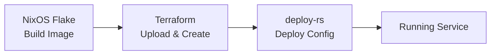

# Terraform Proxmox Infrastructure

Terraform configuration for managing Proxmox VMs and LXC containers, integrated with NixOS image building.

## Overview

This Terraform setup works alongside your NixOS flake:
1. **NixOS** builds the OS images (declarative)
2. **Terraform** manages Proxmox resources (declarative)
3. **deploy-rs** deploys NixOS configurations (declarative)

## Workflow



### Step-by-Step

1. **Build NixOS image:**
   ```bash
   nix build .#caddy-1
   ```

2. **Plan Terraform changes:**
   ```bash
   cd terraform
   terraform init
   terraform plan
   ```

3. **Apply Terraform:**
   ```bash
   terraform apply
   ```

4. **Deploy NixOS config:**
   ```bash
   just deploy-container caddy-1
   ```

## Setup

### Prerequisites

1. **Proxmox API access:**
   - Create API token in Proxmox UI
   - Or use root password (less secure)

2. **SOPS secrets:**
   Edit `secrets/terraform.yaml` (separate from common.yaml for security):
   ```bash
   sops secrets/terraform.yaml
   ```
   
   Update the `proxmox_password` value:
   ```yaml
   proxmox_password: "your-password-or-token"
   ```
   
   **Security Note:** Terraform secrets are kept separate from `secrets/common.yaml` to avoid exposing Proxmox credentials to VMs/containers.

3. **SSH access:**
   - Ensure SSH key is in `~/.ssh/id_rsa` or configure path
   - SSH agent should be running

### Initialization

```bash
cd terraform
terraform init
```

## Usage

### Creating a New VM

1. **Create NixOS config** (if not exists):
   ```bash
   just new-container caddy-1
   # Edit containers/caddy-1/configuration.nix
   # Edit containers/caddy-1/proxmox.nix
   ```

2. **Build image:**
   ```bash
   nix build .#caddy-1
   ```

3. **Create Terraform config** (`terraform/instances/caddy-1.tf`):
   ```hcl
   module "caddy_image" {
     source = "../modules/image-upload"
     
     node_name        = "10.0.0.50"
     local_image_path = "../result/tarball/caddy-1.tar.xz"
     image_type       = "lxc"
   }
   
   module "caddy_instance" {
     source = "../modules/proxmox-lxc"
     
     name         = "caddy-1"
     node_name    = "10.0.0.50"
     description  = "Caddy reverse proxy"
     cores        = 1
     memory       = 512
     disk_size    = "4G"
     storage      = "local-lvm"
     bridge       = "vmbr0"
     image_file_id = module.caddy_image.file_id
     
     ip_address    = "10.0.0.10"
     prefix_length = 24
     gateway       = "10.0.0.1"
     
     unprivileged = true
     start_on_create = true
   }
   ```

4. **Apply Terraform:**
   ```bash
   cd terraform
   terraform plan
   terraform apply
   ```

5. **Bootstrap secrets:**
   ```bash
   just bootstrap-container caddy-1 10.0.0.10
   ```

6. **Deploy NixOS config:**
   ```bash
   just deploy-container caddy-1
   ```

### Updating Resources

Terraform tracks state, so changes to `.tf` files will update resources:

```bash
terraform plan   # Preview changes
terraform apply  # Apply changes
```

### Destroying Resources

```bash
terraform destroy -target=module.caddy_instance
```

**Warning:** This will destroy the VM/container. NixOS configs remain.

## Modules

### `modules/proxmox-vm`

Creates a Proxmox VM from a NixOS-generated image.

**Variables:**
- `name` - VM name
- `node_name` - Proxmox node
- `cores` - CPU cores (default: 2)
- `memory` - RAM in MB (default: 2048)
- `image_file_id` - Uploaded image file ID
- `bridge` - Network bridge (default: vmbr0)

### `modules/proxmox-lxc`

Creates a Proxmox LXC container from a NixOS-generated template.

**Variables:**
- `name` - Container name
- `node_name` - Proxmox node
- `cores` - CPU cores (default: 1)
- `memory` - RAM in MB (default: 512)
- `image_file_id` - Uploaded template file ID
- `ip_address` - Static IP (optional)
- `gateway` - Gateway IP (optional)
- `unprivileged` - Unprivileged container (default: true)

### `modules/image-upload`

Uploads NixOS images to Proxmox.

**Variables:**
- `node_name` - Proxmox node
- `local_image_path` - Path to image file
- `image_type` - "vm" or "lxc"

## State Management

Terraform state is stored locally in `terraform.tfstate`.

**For production/homelab:**
- Commit state to Git (fine for homelab)
- Or use remote state (S3, etc.)

**Backup state:**
```bash
cp terraform.tfstate terraform.tfstate.backup
```

## Integration with Justfile

Add Terraform commands to `Justfile`:

```bash
# Terraform commands
terraform-init:
    cd terraform && terraform init

terraform-plan:
    cd terraform && terraform plan

terraform-apply:
    cd terraform && terraform apply

terraform-destroy NAME:
    cd terraform && terraform destroy -target=module.{{NAME}}_instance
```

## Troubleshooting

### Image Upload Fails

- Check SSH access: `ssh root@10.0.0.50`
- Verify image path exists
- Check Proxmox storage space

### Provider Authentication Fails

- Verify Proxmox credentials in SOPS
- Check API token permissions
- Try `insecure = true` for self-signed certs

### State Lock Issues

If Terraform crashes, state may be locked:
```bash
terraform force-unlock <LOCK_ID>
```

## Best Practices

1. **Always plan before apply:**
   ```bash
   terraform plan
   ```

2. **Use modules** for reusable configurations

3. **Version control** your `.tf` files (not `.tfstate` in production)

4. **Tag resources** for organization

5. **Use variables** for node names, storage, etc.

6. **Prevent accidental destruction:**
   ```hcl
   prevent_destroy = true
   ```

## Migration from Scripts

Your existing scripts (`proxmox-create.sh`) can coexist with Terraform:

- **Scripts:** One-time creation, manual updates
- **Terraform:** Declarative management, state tracking

**Migration path:**
1. Keep scripts for existing resources
2. Use Terraform for new resources
3. Gradually migrate existing resources to Terraform

