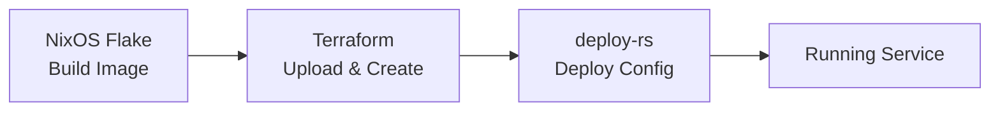

# Terraform Proxmox Infrastructure

Terraform configuration for managing Proxmox VMs and LXC containers, integrated with NixOS image building.

## Overview

This Terraform setup works alongside your NixOS flake:
1. **NixOS** builds the OS images (declarative)
2. **Terraform** manages Proxmox resources (declarative)
3. **deploy-rs** deploys NixOS configurations (declarative)

## Directory Structure

```
terraform/
├── resources/           # Resource pool module
│   └── pools.tf         # Resource pool definitions
├── modules/             # Reusable modules
│   ├── image-upload/    # Image upload module
│   ├── proxmox-lxc/     # LXC container module
│   ├── proxmox-vm/      # VM module
│   └── service-definition/ # Service config helper
├── locals.tf            # Service registry, pools, network config
├── data-sources.tf      # Proxmox data source queries
├── provider.tf          # Provider configuration
├── variables.tf         # Variable definitions
├── outputs.tf           # Output definitions
├── main.tf              # Module calls
└── versions.tf          # Version constraints
```

## Workflow



### Step-by-Step

1. **Build NixOS image:**
   ```bash
   just image-container caddy-1
   ```
   Images are now organized under `results/<name>/result/` for better organization.

2. **Plan Terraform changes:**
   ```bash
   cd terraform
   terraform init
   terraform plan
   ```

3. **Apply Terraform:**
   ```bash
   terraform apply
   ```

4. **Deploy NixOS config:**
   ```bash
   just deploy-container caddy-1
   ```

## Setup

### Prerequisites

1. **Proxmox API access:**
   - **Recommended:** Create API token in Proxmox UI (most secure)
     - Add to SOPS secrets: `proxmox_api_token: "user@realm!token-id=secret"` in `secrets/terraform.yaml`
     - Or set `proxmox_api_token` variable in Terraform (via `TF_VAR_proxmox_api_token` environment variable)
     - Or set environment variable: `export PROXMOX_VE_API_TOKEN="user@realm!token-id=secret"`
   - **Alternative:** Use username/password via SOPS (see below)

2. **SOPS secrets:**
   Edit `secrets/terraform.yaml` (separate from common.yaml for security):
   ```bash
   sops secrets/terraform.yaml
   ```
   
   Add your Proxmox credentials (API token preferred, or username/password):
   ```yaml
   # Option 1: API token (recommended)
   proxmox_api_token: "user@realm!token-id=secret"
   
   # Option 2: Username/password (fallback if API token not provided)
   proxmox_password: "your-password"
   ```
   
   **Security Note:** Terraform secrets are kept separate from `secrets/common.yaml` to avoid exposing Proxmox credentials to VMs/containers. API tokens are preferred over passwords.
   
   **Priority order:** 1) Terraform variable, 2) SOPS `proxmox_api_token`, 3) Environment variable `PROXMOX_VE_API_TOKEN`, 4) Username/password from SOPS

3. **SSH access:**
   - Ensure SSH key is in `~/.ssh/id_rsa` or configure path
   - SSH agent should be running

### Initialization

```bash
cd terraform
terraform init
```

## Usage

### Creating a New VM

1. **Create NixOS config** (if not exists):
   ```bash
   just new-container caddy-1
   # Edit containers/caddy-1/configuration.nix
   # Edit containers/caddy-1/proxmox.nix
   ```

2. **Build image:**
   ```bash
   just image-container caddy-1
   ```
   This creates the image in `results/caddy-1/result/tarball/*.tar.xz`

3. **Add service to registry** (`terraform/locals.tf`):
   
   Services are defined in `local.services` - add or verify your service entry:
   ```hcl
   "caddy-1" = {
     ip_address  = "10.0.0.10"
     category    = "infrastructure"
     pool        = "infrastructure"
     type        = "container"
     cores       = 1
     memory      = 512
     disk_size   = "4G"
     storage     = var.default_storage
     description = "Caddy reverse proxy"
     subdomain   = "caddy.grab-lab.gg"
     tags        = ["reverse-proxy", "ssl"]
   }
   ```

4. **Create instance in `main.tf`**:
   ```hcl
   module "caddy_image" {
     source        = "./modules/image-upload"
     node_name     = local.node_name
     instance_name = "caddy-1"
     image_type    = "lxc"
     storage       = "local"
   }
   
   module "caddy_instance" {
     source        = "./modules/proxmox-lxc"
     name          = "caddy-1"
     node_name     = local.node_name
     description   = local.services["caddy-1"].description
     cores         = local.services["caddy-1"].cores
     memory        = local.services["caddy-1"].memory
     disk_size     = local.services["caddy-1"].disk_size
     storage       = local.services["caddy-1"].storage
     bridge        = local.network.bridge
     pool_id       = local.services["caddy-1"].pool
     image_file_id = module.caddy_image.file_id
     ip_address    = local.services["caddy-1"].ip_address
     prefix_length = local.network.prefix_length
     gateway       = local.network.gateway
     tags          = local.services["caddy-1"].tags
   }
   ```

5. **Apply Terraform:**
   ```bash
   cd terraform
   terraform plan
   terraform apply
   ```

6. **Bootstrap secrets:**
   ```bash
   just bootstrap-container caddy-1 10.0.0.10
   ```

7. **Deploy NixOS config:**
   ```bash
   just deploy-container caddy-1
   ```

### Updating Resources

Terraform tracks state, so changes to `.tf` files will update resources:

```bash
terraform plan   # Preview changes
terraform apply  # Apply changes
```

### Destroying Resources

```bash
terraform destroy -target=module.caddy_instance
```

**Warning:** This will destroy the VM/container. NixOS configs remain.

## Modules

### `modules/proxmox-vm`

Creates a Proxmox VM from a NixOS-generated image.

**Variables:**
- `name` - VM name
- `node_name` - Proxmox node
- `cores` - CPU cores (default: 2)
- `memory` - RAM in MB (default: 2048)
- `image_file_id` - Uploaded image file ID
- `bridge` - Network bridge (default: vmbr0)

### `modules/proxmox-lxc`

Creates a Proxmox LXC container from a NixOS-generated template.

**Variables:**
- `name` - Container name
- `node_name` - Proxmox node
- `cores` - CPU cores (default: 1)
- `memory` - RAM in MB (default: 512)
- `image_file_id` - Uploaded template file ID
- `ip_address` - Static IP (optional)
- `gateway` - Gateway IP (optional)
- `unprivileged` - Unprivileged container (default: true)

### `modules/image-upload`

Uploads NixOS images to Proxmox using the provider's file upload resource.

**Variables:**
- `node_name` - Proxmox node
- `local_image_path` - Path to image file (or use `instance_name` for auto-detection)
- `instance_name` - Instance name for auto-detecting image path
- `image_type` - "vm" or "lxc"
- `storage` - Storage pool/datastore ID (default: "local")

## Data Sources

### Querying Existing Resources

The configuration includes several data sources for querying existing Proxmox resources:

#### Containers
```hcl
data "proxmox_virtual_environment_containers" "all" {
  node_name = "pve"  # Your Proxmox node name
}
```

#### Virtual Machines
```hcl
data "proxmox_virtual_environment_vms" "all" {
  node_name = "pve"  # Your Proxmox node name
}
```

#### Storage/Datastores
```hcl
data "proxmox_virtual_environment_datastores" "all" {
  node_name = "pve"  # Your Proxmox node name
}
```

**Use Cases:**
- Check if a container/VM exists before creating it
- Avoid duplicate resource creation
- Reference existing resources in other resources
- List all resources for inventory/audit purposes
- Query available storage pools

**Outputs Available:**
- `existing_containers` / `existing_container_ids` - Container information
- `existing_vms` / `existing_vm_ids` - VM information
- `available_datastores` - Available storage pools

## State Management

Terraform state is stored locally in `terraform.tfstate`.

**For production/homelab:**
- Commit state to Git (fine for homelab)
- Or use remote state (S3, etc.)

**Backup state:**
```bash
cp terraform.tfstate terraform.tfstate.backup
```

## Integration with Justfile

Add Terraform commands to `Justfile`:

```bash
# Terraform commands
terraform-init:
    cd terraform && terraform init

terraform-plan:
    cd terraform && terraform plan

terraform-apply:
    cd terraform && terraform apply

terraform-destroy NAME:
    cd terraform && terraform destroy -target=module.{{NAME}}_instance
```

## Troubleshooting

### Image Upload Fails

- Check SSH access: `ssh root@10.0.0.50`
- Verify image path exists
- Check Proxmox storage space

### Provider Authentication Fails

- **If using API token:** Verify `PROXMOX_VE_API_TOKEN` environment variable or `proxmox_api_token` variable
- **If using SOPS:** Verify Proxmox credentials in `secrets/terraform.yaml`
- Check API token permissions (needs VM/Container management permissions)
- Try `insecure = true` for self-signed certs
- Ensure SSH access works if using VM restore (for vma.zst backups)

### State Lock Issues

If Terraform crashes, state may be locked:
```bash
terraform force-unlock <LOCK_ID>
```

## Best Practices

1. **Always plan before apply:**
   ```bash
   terraform plan
   ```

2. **Use modules** for reusable configurations

3. **Version control** your `.tf` files (not `.tfstate` in production)

4. **Tag resources** for organization

5. **Use variables** for node names, storage, etc.

6. **Prevent accidental destruction:**
   ```hcl
   prevent_destroy = true
   ```

## Migration from Scripts

Your existing scripts (`proxmox-create.sh`) can coexist with Terraform:

- **Scripts:** One-time creation, manual updates
- **Terraform:** Declarative management, state tracking

**Migration path:**
1. Keep scripts for existing resources
2. Use Terraform for new resources
3. Gradually migrate existing resources to Terraform

