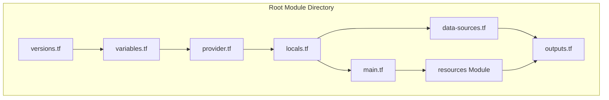

# Terraform Structure and File Loading

## How Terraform Loads Files

Terraform loads `.tf` files from the **root module directory** (where you run `terraform` commands). Important points:

1. **Root directory files**: All `.tf` files in the root directory are automatically loaded
2. **Subdirectories**: Files in subdirectories are **NOT automatically loaded** unless:
   - They are part of a module that is explicitly called with `module` blocks, OR
   - They are in special directories like `modules/` (which are called explicitly)

## Current Structure

```
terraform/
├── Root Module Files (loaded automatically)
│   ├── versions.tf          # Provider requirements
│   ├── variables.tf         # Variable declarations
│   ├── provider.tf          # Provider configuration
│   ├── locals.tf            # Service registry, pools, network config
│   ├── data-sources.tf      # Data source queries
│   ├── outputs.tf           # Output definitions
│   └── main.tf              # Module calls
│
├── resources/ (Module - called explicitly)
│   ├── versions.tf          # Provider requirements for module
│   ├── variables.tf         # Module inputs
│   ├── pools.tf             # Resource pool definitions
│   └── outputs.tf           # Module outputs
│
└── modules/ (Reusable modules - called explicitly)
    ├── image-upload/        # Upload NixOS images to Proxmox
    ├── proxmox-lxc/         # Create LXC containers
    ├── proxmox-vm/          # Create VMs
    └── service-definition/  # Helper for service config lookup
```

## Why `resources/` is a Module

The `resources/` directory is organized as a **module** because:

1. **Isolation**: Keeps resource pool definitions separate
2. **Explicit loading**: Must be called via `module` block in `main.tf`
3. **Proper structure**: Follows Terraform best practices for organization
4. **Dependency management**: Can have its own provider requirements

## Service Registry Approach

All service definitions are centralized in `locals.tf`:
- `local.services` - Complete service registry with IP, resources, pools
- `local.resource_pools` - Pool definitions with resource limits
- `local.pool_allocations` - Computed resource usage per pool

This approach allows:
- Single source of truth for all service configuration
- Validation of resource limits via `check` blocks
- Easy iteration with `for_each` when creating instances

## File Loading Order



## Module vs Root Module Files

### Module (resources/)
- **Must be called**: Requires `module` block in root
- **Has its own scope**: Variables, outputs, providers
- **Isolated**: Can't directly access root `locals` (must pass as variables)
- **Example**: `module "resource_pools" { source = "./resources" }`

### Root Module Files
- **Auto-loaded**: Loaded automatically by Terraform
- **Shared scope**: Can access all root `locals` and `variables`
- **Direct access**: No `module` block needed
- **Example**: `locals.tf` contains service registry accessible throughout

## Best Practices

1. **Use modules** for:
   - Reusable components (like `modules/proxmox-lxc`)
   - Organized resource groups (like `resources/` for pools)
   - Components that need isolation

2. **Use root module files** for:
   - Service registry (`locals.tf`)
   - Data sources (`data-sources.tf`)
   - Outputs (`outputs.tf`)

3. **Always call modules explicitly**:
   ```hcl
   module "resource_pools" {
     source = "./resources"
     resource_pools = local.resource_pools
   }
   ```

4. **Use service registry for instances**:
   ```hcl
   module "containers" {
     for_each = { for k, v in local.services : k => v if v.type == "container" }
     source   = "./modules/proxmox-lxc"
     name     = each.key
     # ... other values from each.value
   }
   ```

## References

- [Terraform Modules Documentation](https://developer.hashicorp.com/terraform/language/modules)
- [HashiCorp Discuss: Subdirectories](https://discuss.hashicorp.com/t/use-terraform-module-sub-directory/32698)


